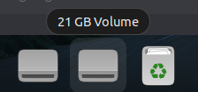
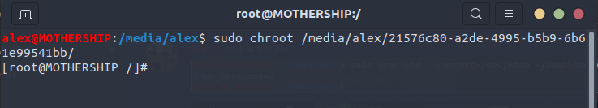
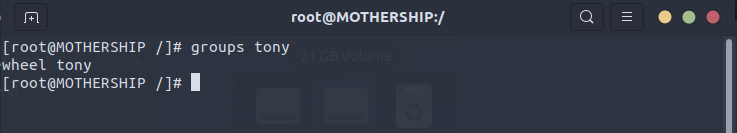
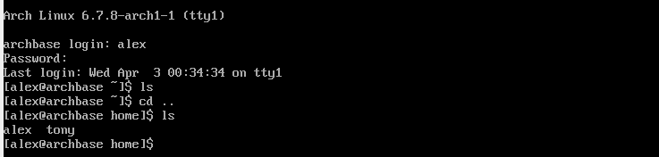

### Task: VM Incident - A user forgot their password
- *Given a image, change add a user to the VM using chroot*
- #### What is chroot?
	- chroot allows us to change the root directory of our shell.
	- This, in turn, allows us to create an isolated environment. 
	- The shell essentially treats this new root directory as something independent of our host 
- #### Where would you use it?
	- This would be used on images that we would like to emulate to do certain.. things..
- #### What exactly does it do?
	- The chroot command, when ran, treats the new directory as it's root
		- This means that it will use it's own /etc/passwd, /etc/shadow, and all directories a normal environment would utilize.
		- **We can change the passwords of any users** 
- #### How do you mount a drive from the command line?
	- Normally, if we have a drive we want to mount, we just create a directory, usually in */mnt*
		- ```sudo mkdir /mnt/mount_point```
	- Then, once we have our directory, we use the *mount* command to mount the drive
		- ```mount /dev/drive_name /mnt/mount_point```
	- Mounting a .qcow image isn't as simple as just using the ```mount image /dir``` command
- #### What is qcow2?
	- It's essentially a file format used for virtual disk images
- #### How do we mount this thing?
	- Following this [guide](https://www.baeldung.com/linux/mount-qcow2-image) online, the best solution for this is to use the *Network Block Device(NBD)* service
		- *NBD is a service that allows access to block devices over a network*
	- First, we have to load the NBD kernel module using modprobe:
		- ```sudo modprobe nbd```
	- Next, we connect the qcow2 image to the NBD device
		- ```sudo qemu-nbd --connect=/dev/nbd0 ~/Downloads/arch.qcow2```
- ### Tony's Method (Better)
	- Check and make sure everything is in working order:
		- `lsblk: make sure your nbd devices there there`
	- Now we just mount it:
		- `sudo mount /dev/nbd0p2 /mnt/`
	- Our new directory is now mounted in `/mnt/`
		- `sudo chroot /mnt/`
	- If we want to share our /proc and /sys directories:
		- `mount -t proc proc /proc`
		- `mount --rbind /sys sys/`
		- `mount --rbind /dev dev/` 

		- We're pretty much done here. We just need to unmount the drive, then disconnect the nbd drives in order to test run this VDI on VirtualBox
		- ```sudo qemu-nbd --disconnect /dev/nbd0```
		- ```sudo qemu-nbd --disconnect /dev/nbd1```
		- ```sudo rmmod nbd```

- ### Alex's Method
	- At this point, we have the drive mounted. If you're using a graphical interface the drive should pop up in your toolbar
	 
	 - The drive is actually currently stored in our /media/ folder.
	 - At this point, we can utilize chroot to switch our root directory to the mounted drive
		 - ```sudo chroot /media/alex/21576c80-a2de-4995-b5b9-6b61e99541bb/```
 
	 - Now that we're in. Let's solve this problem. We have to add a user to the VM. Then, put that user in a group.
	 - First, let's find out what groups our old user *tony* is currently in:
		 - ```groups tony```


	- Im going to create a user, set it's password, add that user to the same group(s) as *tony*
		- ```useradd alex```
		- ```passwd alex```
		- ```usermod -a -G wheel alex```
	- We're pretty much done here. We just need to unmount the drive, then disconnect the nbd drives in order to test run this VDI on VirtualBox
		- ```sudo qemu-nbd --disconnect /dev/nbd0```
		- ```sudo qemu-nbd --disconnect /dev/nbd1```
		- ```sudo rmmod nbd```
- #### Testing the modified drive
	- Moving onto VirtualBox, all we need to do is 
		- Create a new machine
		- When asked, set the Virtual Hard Disk to our qcow2 drive
	- Just to show that things are working properly, below is a screenshot of me logging into the user I created for this task.


- #### Extra stuff
	- What are the **/sys** and **/proc** directories?
		- **/sys** is a directory that contains information on kernel configurations, and other various properties. Apparently there is another way to solve this task and we have to temporarily mount this filesystem. This enables processes to interact with the kernel
		- **/proc** contains directories representing each running process. This is also used for the alternate solution in the same manner
	- How do you change a password from the command line?
		- ```passwd \<user\>```
	- How do you add a user on the command line? How do you put a user in a group?
		- ```useradd <user>```
		- ```usermod -a -G <group> <user>```
		- *-a*: append to current group list of user
		- *-G*: declare group name
- ##### Sources Cited:
	- https://www.baeldung.com/linux/mount-qcow2-image
	- https://wiki.archlinux.org/title/chroot
	- https://wiki.lib.sun.ac.za/images/c/ca/TLCL-13.07.pdf

