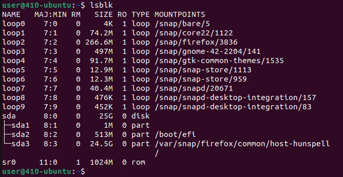
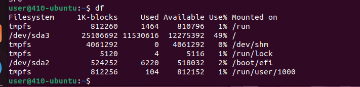
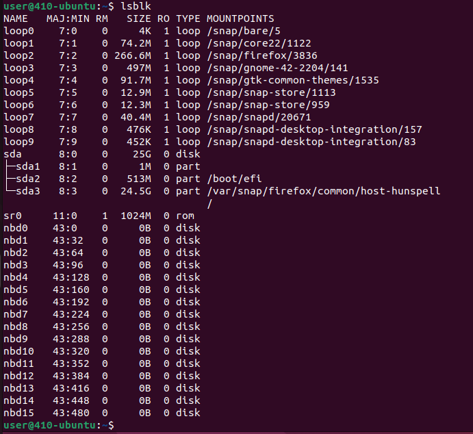

### Task: Day 2 - (cont.)

- #### What is a block device?
	- A *block device* is a type of computer storage that allows data to be stored in blocks.
	- Each block is a fixed size. When a file is stored on a block device, it is divided into chunks that fit the block.
	- Common examples of block devices include: Hard drives, solid-state drives, and USB flash drives
- #### How would one list all the block devices in Linux?
	- The common command to list block devices is: ```lsblk```
	- By default, this command lists all block devices. 

	- ##### Where does the program you mentioned above get it's information?
		- To retrieve the information that lsblk outputs, it parses through the /sys directory.
		- The command can see block device information in the /sys/block directory, which stores information about *loop* devices
			- Loop devices a block device that maps a normal file onto a block device. 
			- This is primarily used for ISO images or floppy disk images.
	- ##### What command line argument would you add to show the file system on each block device?
		- To show the file system on each block device, we can add a ```-f``` flag:
			- ```lsblk -f``` 
			- This command also shows details like the UUID, type (FAT32, etc...), and label.
- #### What command line tool would I use to list file system space usage?
	- To view disk utilization we can use the ```df``` command. This will show us things like the filesystem, the size, the amount used, the amount available, and what it's mounted on.

- #### Are the block devices listed on your machine modified after you run ```sudo modprobe nbd```?
	- This command is used to load Network Block Device into the kernel. This essentially allows you to use a remote server as a local block device. For example, we could mount a file system located on another machine over the network.
	- ##### If so, how?
		- When you load the nbd module using modprobe, it makes several block device entries (0-15). All of these entries can be used to connect block devices over a network.


##### Sources Cited:
- https://www.geeksforgeeks.org/lsblk-command-in-linux-with-examples/
- https://medium.com/@aysadx/linux-nbd-introduction-to-linux-network-block-devices-143365f1901b
- https://man7.org/linux/man-pages/man8/lsblk.8.html
- https://en.wikipedia.org/wiki/Loop_device#:~:text=In%20Linux%2C%20device%20names%20are,%2Fdev%2Floop1%2C%20etc.
