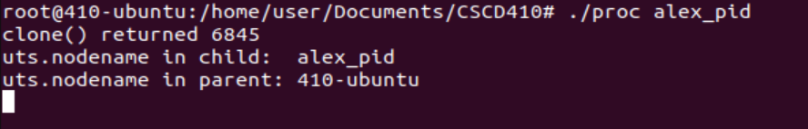

### What are Linux namespaces?  
- *namespaces* abstract system resources to specific process such that each process views the isolated resources as their own global resource.
- This ensures isolation between other processes, giving us another layer of security as processes can't interact with each other through resources.
### What types of namespaces are there?  
- Each namespace type has it's own unique properties:
	- *cgroup*
		- Allow for us to set resource limits for groups and their subgroups
	- *IPC*
		- Provides isolation of shared memory segments, message queues, and semaphores
	- *Network*
		- Each network namespace will have it's own independent network configuration
	- *Mount*
		- Isolation from the systems mount points.
		- Each mount namespaces has it's own mount points
	- *PID*
		- Group of processes will have their own set of unique PIDs
	- *Time*
		- This will allow us to set the time to a namespace that could be different than our actual system time.
	- *User*
		- Isolates user and group ID, each namespace will have it's own set of users and group IDs with different privileges and ownership. 
	- *UTS*
		- Each namespace can have it's own hostname and domain group. 
### Where would I find the namespaces associated with a PID?  
- To find which namespace a specific PID is in, we can find it in the `/proc` directory:
	- Grab the PID
		- `ps -aux | grep <process_name>`
	- Find the PID in /proc
	- `cd /proc/<pid>/ns/`
- How do I read the value of the files in the directory?  
	- we can use *readlink*  in the current directory to find the namespaces associated
		- `sudo readlink <namespace>`
	- What exactly is this value?  
		- This value is the *inode* number of the process
			- Used to uniquely identify a process, along with its device ID
### What program from the command line can I use to move a process to a namespace?  
- The *unshare* system call moves a process to a namespace
	- `unshare [options] [program [arguments]]`
	- `unshare -p [pid [argunents]]`
### Write/find a program using clone that can change the namespace.
- Within the. *clone(2)* man page, there is code for using clone that changes the namespace.
- Here's the output of the program:
	- 

##### Sources Cited:
- https://man7.org/linux/man-pages/man7/namespaces.7.html
- https://man7.org/linux/man-pages/man2/clone.2.html
- https://www.nginx.com/blog/what-are-namespaces-cgroups-how-do-they-work/
