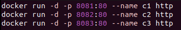

**Add a volume (or bind mount) to your docker container.**  
- There are multiple ways to add a volume or bind mount to a docker container:
- In this instance, we will have a container with the tag name `http`
	- **Volume**
		- Volumes are managed by docker and are more robust than bind mounts:
		- To create a volume:
			- `docker volume create new_volume`
		- To attach a volume to a container:
			- I assume here you have a root directory file named /app
			- You must use absolute paths
			- `docker run -v new_volume:/app -d -p 9000:8000 http`
	- **Bind mounts**
		- This is pretty similar, except the "volume" is managed by us:
			- `mkdir /home/$USER/docker_mount`
			- `docker run -v /home/$USER/docker_mount:/app -d -p 9000:8000 http`
- **How do I add persistent storage to a docker container?**  
	- Docker volumes are a persistent storage solution for containers
- **What is the difference between a volume and bind mount?**
	- Volumes are managed by Docker
	- Bind mounts are managed by the user.

**In no less than a paragraph write about:**  
- **How you could emulate docker from your lab 2 assignment.** 
	- In order to emulate resource constraints like our lab2, we can use various flags that will limit resources like CPU and memory:
		- `docker run -m 512m http`
			- Limit memory
		- `docker run --cpus=2 http`
			- Limit CPU
	- By default, without specifically limiting resources to a container, there is no limit to how much they can use.
- **Make different types of containers (e.g., Ubuntu, alpine, python...).**  
	- Making different containers is as easy as just putting the distribution name you want to use appended to the `FROM` prefix. If you want to use the latest version, we just put `:latest`
		- **Ubuntu**
			- `FROM ubuntu:latest`
		- **Alpine**
			- `FROM alpine:latest`
		- **Python**
			- `FROM python:3.10-slim`
		- **Arch**
			- `FROM archlinux:latest`
- **Make more than 1 of the same container simultaneously.**  
	- To create more than 1 of the container simultaneously:
		- Our first option is to use a bash script that will spin them up:
			- 
			- This will create 3 docker container replicas serving content on different ports with unique names "c1, c2, c3".
		- Another option would be to use `docker-compose.yml`
			- deploy: 
				- replicas: 3
			- Adding this command to your compose file will generate 3 replicas of the same container at the same time. 
- **Have work done in the container not be persistent.**  
	- Containers, by default, are not persistent between boots. To ensure this stays the same it might be important to not utilize bind mounts or volumes. The ephemeral nature of containers is what makes them great for stateless applications, as it allows for clean deployments without the risk of previous sessions affecting the current state. This characteristic is valuable in environments where consistency and isolation between processes are critical.
- Anything else you’ve noticed docker does.  
	- Container orchestration is something that is possible in docker. The ability to spin up an entire load balancing, scalable infrastructure is a key feature that is a very marketable skill.
	- We didn't use it here, but `docker-compose` files are used for building multi-container applications. We can configure things like networking, services, and volumes all in a single file, then spin up multitudes of containers with a single command.

**Extra Credit:**
- Limit the CPU or Memory of your container. (1 point)
	- ![[Screenshot 2024-04-18 at 11.38.19 AM.png]]
		- `docker run -d -p 9000:8000 --cpus=2 http`
		- This command spins up a docker container serving content on our host computers port 9000. It is constrained to 2 CPUs and it's tagname is http.
