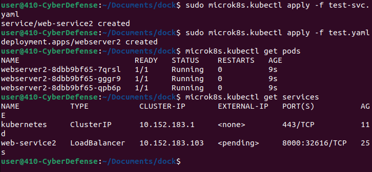

# Lab 4 - More k8s
###### CYBR410 - Applied Cyber Operations 
~~04-29-24 - Alexander Moomaw~~
## Simple Container
*Create a simple program that we can easily tell is running behind a load balancer. This can be as easy as creating a random number each time the program starts (that is returned to the user) or a counter that increments each time the page is loaded.*

### Create the server:
- Utilize Pythons' *flask* and *random* module
- Generate a global random int between 1 and 100 
- Create a function bound to our web servers root directory that serves our index.html file and inserts our random integer into the home page
- Serve our content locally on port 8000

### Inside index.html:
- Make a new directory inside our web server directory, named templates.
- Place our index.html file in the templates directory
- Create generic content that displays that random integer

## Kubernetes
*As before, push the new container to our k8s registry and create the two yaml files needed to run your container in k8s.  Make sure you can reach your service and that it’s running via a k8s pod (exactly the same thing as last lab).*
### To push our newly created web server to kubernetes:
- `docker tag flask localhost:32000/flask:k8s`
- `docker push localhost:32000/flask:k8s`

### What needs to change in our YAML file:
- Inside test.yaml:
	- `image: localhost:32000/flask:k8s`

### Spin up our cluster:
- `microk8s.kubectl apply -f test.yaml`
- `microk8s.kubectl apply -f test-svc.yaml`

## More Kubernetes
*Delete a process running in the pod/container you created (kill -9 PID). Run the command that shows the pods (microk8s.kubectl get pods –all-namespaces), has anything changed? Elaborate.*

*Try and reach the service you created many times (curl or browser). Can you observe the load balancer at work? Do you always get the same page? Do you always get a different page?*

*Describe a service (microk8s.kubectl describe service SERVICE NAME).Can I reach each individual pod being load balanced? Where do you see this information? Explain how this could be useful*

