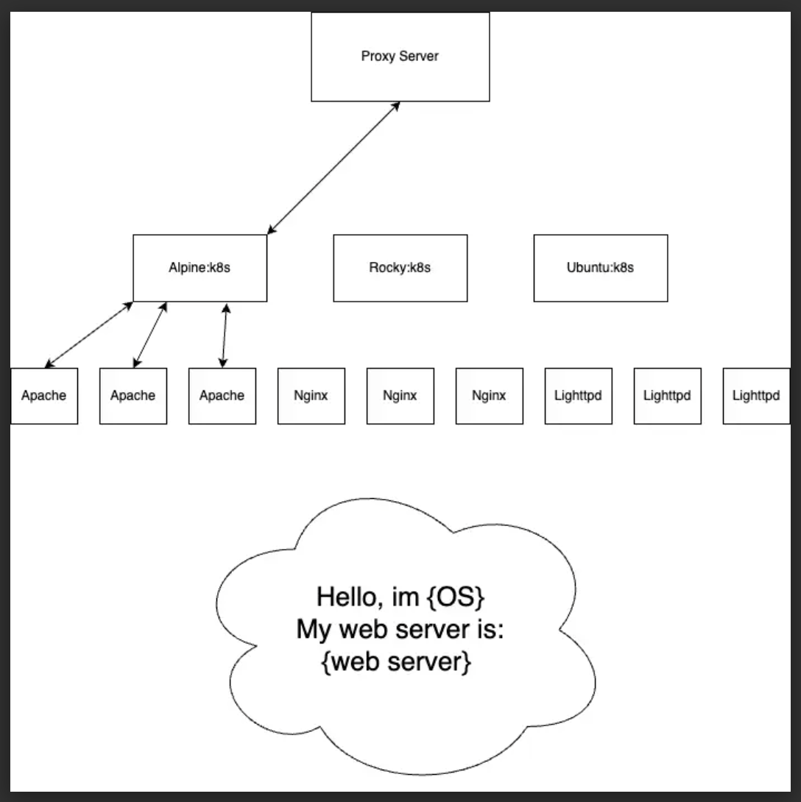

<h4 style="align-text:left"><strong>Scenario in which your system is to be deployed.</strong></h4>
<ul><li>Our environment will be deployed across 3 kubernetes clusters</li>
<li>The big picture is that we have 3 different web servers hosting the same content that will be retrieved by a proxy server.</li>
</ul>
<h4 style="align-text:left"><strong>What kind of attacks does your MTD technique defend against?</strong></h4><ul><li>This moving target defense technique would make it significantly difficult to establish a foothold with which to work on. If the attackers can't statically attack a single web server they won't have a sure-fire attack on our environment.</li>
<li>Example: Attacker enumerates our web server to find the version, they find an Apache server. The attacker utilizes this information to find an active vulnerability on our apache server. The attacker sends their exploit on this vulnerability to our proxy. The attack doesn't work because they sent the apache exploit to an nginx server.</li>
<li>This method of defense will be tested in a microservices deployment, but can be done in both. This defense would aim to defend against Reconnaissance and Discovery MITRE ATT&CK columns</li>
</ul>

