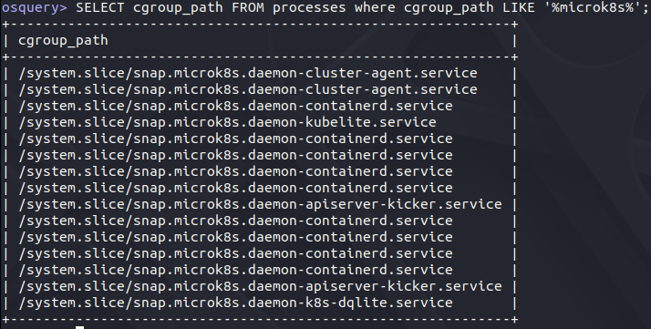
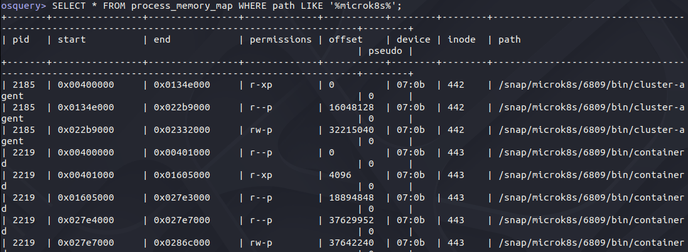

# OSQuery


**List all cron jobs on your machine.**
- `SELECT * FROM crontab;`
- ![[Pasted image 20240513121839.png]]
**List all the docker images. Then calculate when each image was created.**  
- `SELECT * FROM docker_images`
- 
```
1715226948: Your time zone: Wednesday, May 8, 2024 8:55:48 PM GMT-07:00 DST 
1715225969: Your time zone: Wednesday, May 8, 2024 8:39:29 PM GMT-07:00 DST 
1715222247: Your time zone: Wednesday, May 8, 2024 7:37:27 PM GMT-07:00 DST
```

**List all processes that are using a microk8s cgroup_path.**  
- 
**List all the memory mappings for microk8s processes.**
- 
**Start by running something in microk8s. Find out what cgroup_path your processes are using with osquery.**
- 
