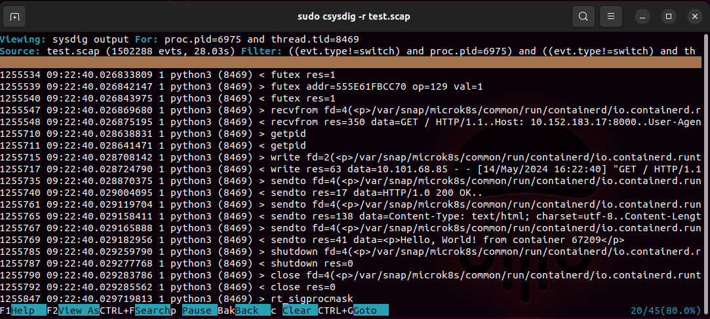

## Find the program that sent “Hello, World! from container 20698
- \\python search
- proc.pid=6975
- 
## Find the system call that program used to send the data.
- The systemcall name is sendto, which can be found by the attached image.
