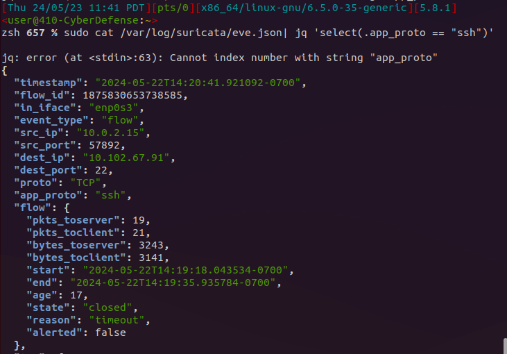
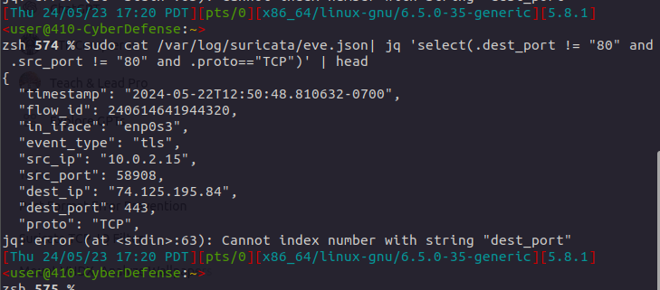

### Tell me about 5 different event types in suricata.  
- **HTTP** - Captures HTTP requests and response packets including the header, URLs and status codes.
- **DNS** - Captures DNS traffic including query types, response codes, and domains.
- **Alerts** - This event type contains data about any signatures that matched known actions that are defined within the software. Includes: impact, severity, category, and even affected product.
- **Anomaly** - Reports unexpected behaviors of incoming or outgoing traffic such as invalid packets. This event type does return what the specific anomalous action was that occurred. 
- **TLS** - The event type returns TLS certificate information. Fields included: subject, issuer, serial, and fingerprint, etc.. 

### Make a query to show all ssh traffic.  
- 

### Make a query to show all TCP traffic not on port 80.  
- 

